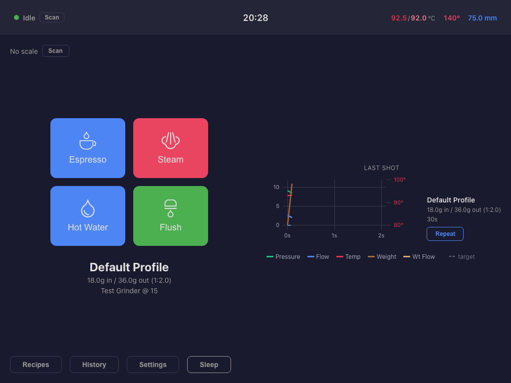
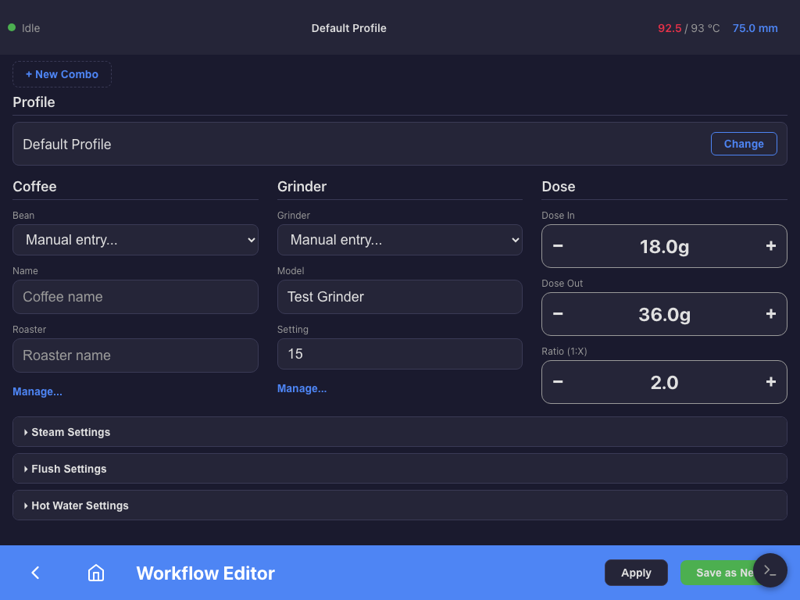
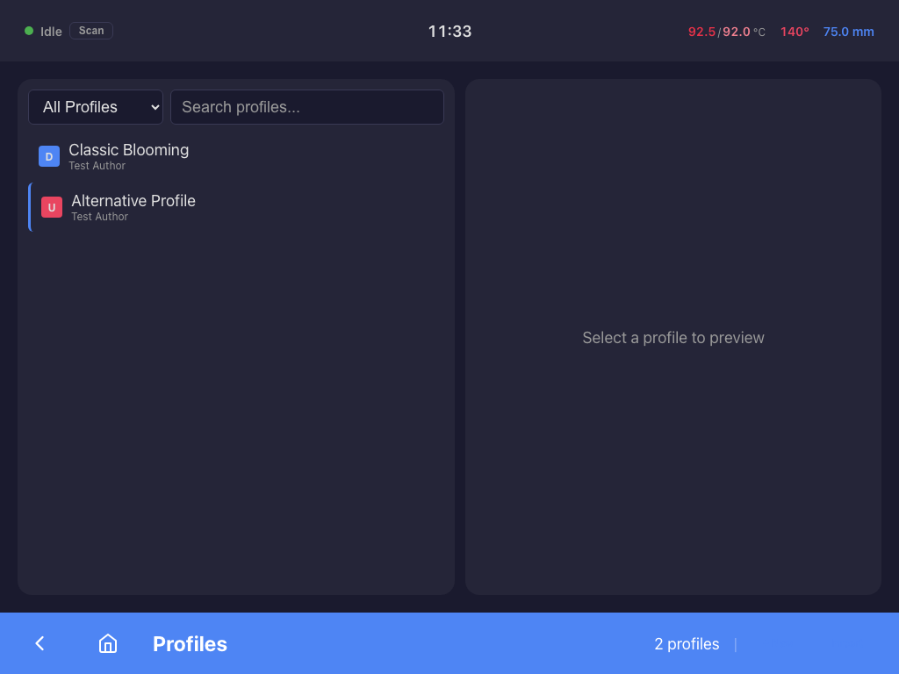
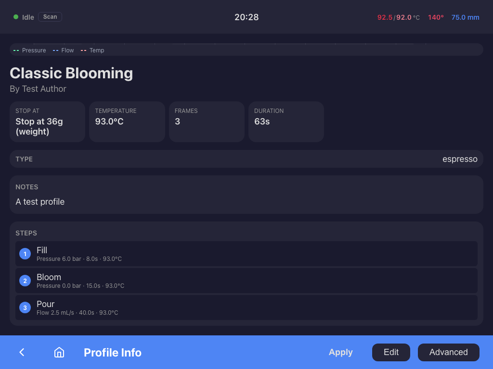
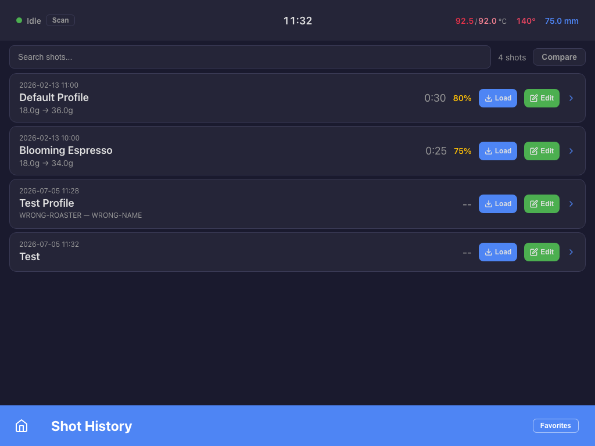
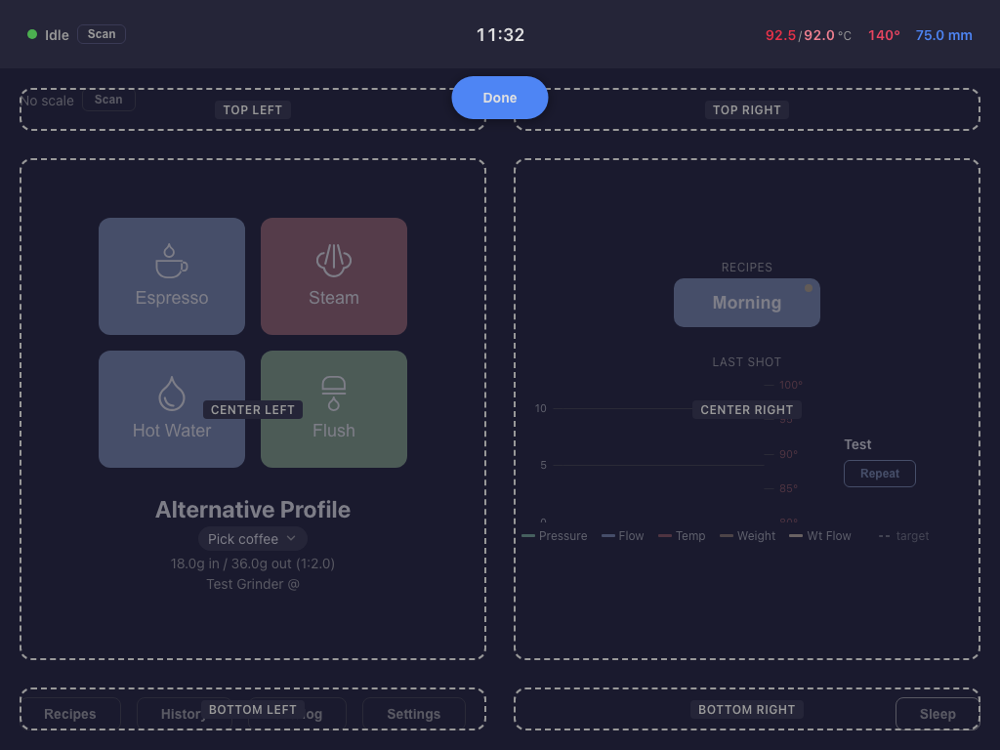
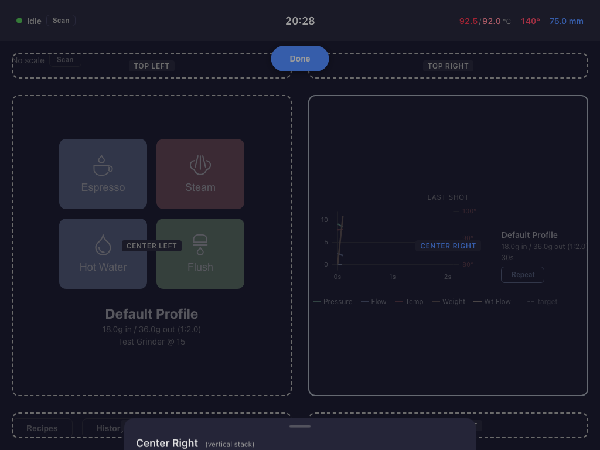
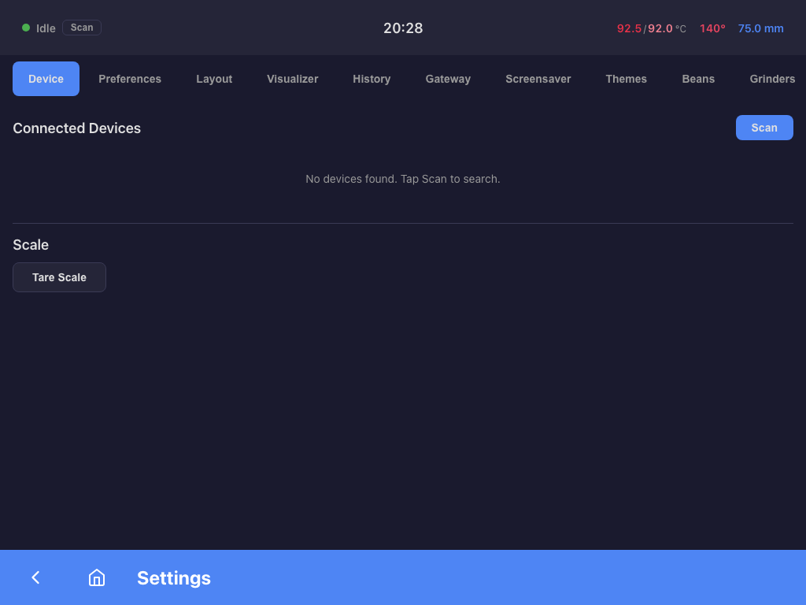

# Passione

A modern web interface for the [DE1 espresso machine](https://decentespresso.com) via [Streamline-Bridge](https://github.com/tadelv/reaprime).



## Features

### Home Screen

The home screen shows real-time machine data and quick-access operation buttons.

- **Circular gauges** for group head temperature, steam temperature, and water level
- **Operation buttons** (Espresso, Steam, Hot Water, Flush) with two-step confirmation to prevent accidental starts
- **Shot plan** showing the active profile, dose, yield, ratio, and grinder setting
- **Workflow presets** for one-tap switching between saved brewing configurations
- **Status bar** with machine state, active profile, temperature, and water level

### Workflow Editor

Create and manage complete brewing workflows — profile, beans, grinder, dose, and operation settings in one place.



- Set profile, coffee, grinder, dose in/out, and ratio
- Configure steam, flush, and hot water settings per workflow
- Save as named presets for quick access from the home screen
- Tap a preset to load all settings; double-tap to start espresso

### Profile Management

Browse, search, and manage espresso profiles.





- Search and filter profiles by name or author
- Visual profile graph showing pressure, flow, and temperature curves
- View step-by-step breakdown of each profile frame
- Apply profiles to the current workflow with a single tap
- **Simple Profile Editor** for classic 4-step pressure/flow profiles (Temperature, Preinfuse, Hold/Rise, Decline, Stop at Weight) -- perfect for beginners
- Advanced frame-by-frame editor for power users
- ProfileInfoPage automatically routes to the correct editor based on profile type

### Shot History

Review past shots with detailed metrics.



- Paginated list of all shots with profile, dose, duration, and rating
- Search across profile names, coffee, roaster, and grinder
- **Load** button restores the shot's full workflow (profile, coffee, grinder, dose)
- **Edit** button to edit shot notes and rating
- Compare up to 3 shots side-by-side with overlaid graphs
- Import shots from Visualizer

### Layout Customization

Rearrange the home screen to show what matters to you.




- Enter edit mode from Settings > Layout > "Edit Layout"
- Six configurable zones (top, center, bottom -- left and right)
- Drag to reorder, add, or remove widgets from each zone
- Changes apply in real time -- edit directly on the live home screen
- Available widgets: gauges, action buttons, shot plan, workflow presets, clock, water level, navigation, connection status, scale info, fullscreen toggle

### Settings



- **Device**: Scan and connect to DE1 machines and scales
- **Preferences**: Water level units (mm/ml), brew dialog, post-shot review
- **Layout**: Launch the visual layout editor or reset to defaults
- **Visualizer**: Import shots from Decent Visualizer
- **History**: Shot history management
- **Gateway**: Configure Streamline-Bridge connection
- **Screensaver**: Choose between ambient glow, last shot recap, or shot graph modes
- **Themes**: Color scheme selection
- **Beans**: Manage your coffee bean library
- **Grinders**: Manage grinder profiles

### Espresso Extraction

- **Phase Timeline** showing real-time extraction progress (Preheat, Pre-infusion, Pouring, Ending) with profile tracking color feedback (green/amber/red)
- **Cup Fill Visualization** -- animated cup graphic tracking yield weight vs target during brewing
- **Real-time shot graphs** with pressure, flow, temperature, and weight curves

### Shot Review

- **Post-shot review** with shot graph, notes, rating, TDS/EY
- **Phase Summary Panel** -- collapsible per-phase metrics table showing duration, avg pressure, avg flow, and weight gained per extraction phase
- Shot annotations support (new structured format alongside legacy fields)

### Auto-Favorites

Analyzes your shot history to surface your best-performing bean, profile, and grinder combinations.

**How it works:** The page fetches all your shots, groups them by the criteria you choose, computes average metrics per group, and sorts by rating. This lets you quickly see which setups produce your best espresso and reload them with one tap.

- **Group by**: Bean, Profile, Bean + Profile, or Bean + Profile + Grinder
- **Metrics per group**: average rating, average dose, average yield, average duration, shot count
- **Load**: applies the group's profile, coffee, and grinder settings to your current workflow
- **Show Shots**: navigates to shot history filtered to that combination
- Accessible from the Shot History page via the "Favorites" link in the bottom bar

### Additional Features

- **Descaling wizard** for guided machine maintenance
- **Screensaver** with multiple modes (ambient glow, last shot recap, shot graph)
- **Power & sleep** schedule management with keep-awake timers
- **Keyboard shortcuts** for power users (E/S/W/F to start operations, Space/Escape to stop)
- **Accessibility**: WCAG AAA targets, comprehensive ARIA labels, keyboard navigation, 44px+ touch targets

## Installation

Passione is a skin for [Streamline-Bridge](https://github.com/tadelv/reaprime). You need Streamline-Bridge running on your DE1 tablet or local network.

### From GitHub Release (recommended)

1. Open Streamline-Bridge settings on your tablet
2. Go to **Skins** settings
3. Install from URL using the latest release ZIP:

```
https://github.com/tadelv/passione/releases/latest/download/passione-v0.4.0.zip
```

Or via the REST API:

```bash
curl -X POST http://<tablet-ip>:8080/api/v1/webui/skins/install/github-release \
  -H "Content-Type: application/json" \
  -d '{"repo": "tadelv/passione", "asset": "passione-v0.4.0.zip"}'
```

### From GitHub Branch (latest development)

```bash
curl -X POST http://<tablet-ip>:8080/api/v1/webui/skins/install/github-branch \
  -H "Content-Type: application/json" \
  -d '{"repo": "tadelv/passione", "branch": "main"}'
```

### Set as Default Skin

After installing, set Passione as the default skin:

```bash
curl -X PUT http://<tablet-ip>:8080/api/v1/webui/skins/default \
  -H "Content-Type: application/json" \
  -d '{"skinId": "passione"}'
```

Then open `http://<tablet-ip>:3000` in a browser.

## Development

### Prerequisites

- Node.js 20+
- A Streamline-Bridge instance (or use the mock server for testing)

### Setup

```bash
npm install
```

### Dev Server

```bash
npm run dev
```

The dev server proxies API and WebSocket requests to Streamline-Bridge. Configure the gateway address in `.env.local`:

```
VITE_GATEWAY_URL=http://<tablet-ip>:8080
VITE_WS_URL=ws://<tablet-ip>:8080
```

### Build

```bash
npm run build        # Output in dist/
npm run preview      # Preview the production build locally
```

### Test

```bash
npm run test:e2e     # Playwright end-to-end tests (against mock server)
```

## Tech Stack

- **Vue 3** with Composition API and `<script setup>`
- **Vite** for build and dev server
- **vue-router** with hash-based routing
- **vue-i18n** for internationalization
- **uPlot** for real-time shot graphs
- **Playwright** for end-to-end testing

## License

MIT
